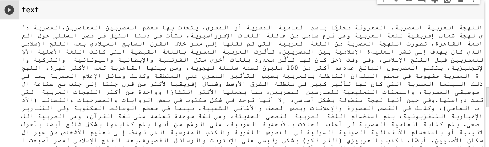
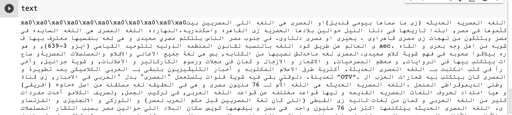
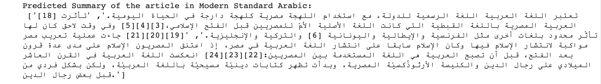
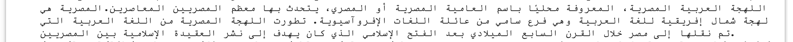
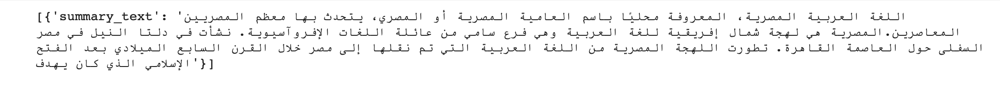

# arabic-text-summarization 📚

For this task the following is used:
1. for text preprossing: NLTK library
2. for text summarization two different strategies used:
   - Frequency Method
   - Transformers

The data that I used are two Wikipedia articles one for [Modern Standard Arabic(MSA)](https://ar.wikipedia.org/wiki/لهجة_مصرية) and the other in [Egyptian Arabic (dialect)](https://arz.wikipedia.org/wiki/اللغه_المصريه_الحديثه)

Here is what the input data (MSA) looks like:

And here is  the input data  for Egyptian Arabic:

1. Text Preprocessing
there is many nlp .........

the main two are: **NLTK and sPacy**
because 
but I choose NLTK

 - **NLTK library**
I used NLTK library to remove HTML tags, punctuations, and symbols from text. Also I used to define stop words.

2. Text Summarization

 - **Text Summarization Using the Frequency Method**
   In this method, we first find the frequency of all the words in our text data. We do this by creating a dictionary where each word is associated with its frequency. Once we have the frequency dictionary, we tokenize our text data. Finally, we select the sentences that contain the most high-frequency words and store them in our final summary data.

Here is the output of the Summarization of MSA Wikipedia Page. It is a 111 words summary:

 - **Text Summarization Using Hugging Face Transformers**
I used the HuggingFace transformers library. The Transformers library provides thousands of pre-trained models to perform tasks such as text summarization. the two pre-trained models that i try and worked are the following:

1. [Albert](https://huggingface.co/albert-base-v2) ⭐️: 

Summarization Output. It is a 55 words summary:

2. [mBART-50](https://huggingface.co/facebook/mbart-large-50) ⭐️: 

Summarization Output. It is a 59 words summary:

I have noticed that the mBART-50 model only outputs the first words of a text based on the maximum length specified.

